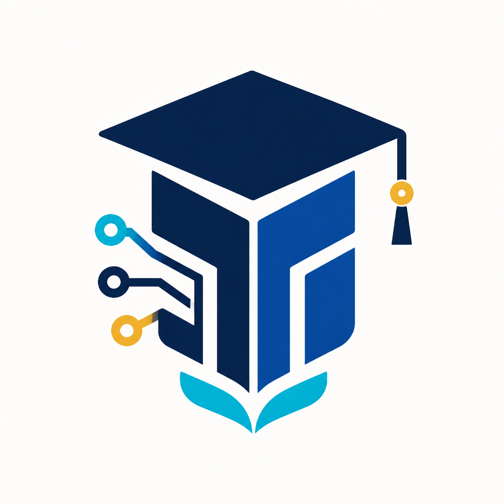
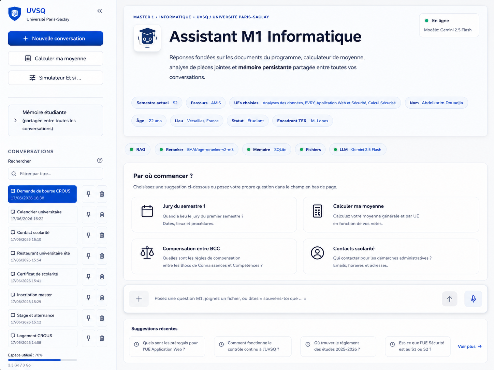
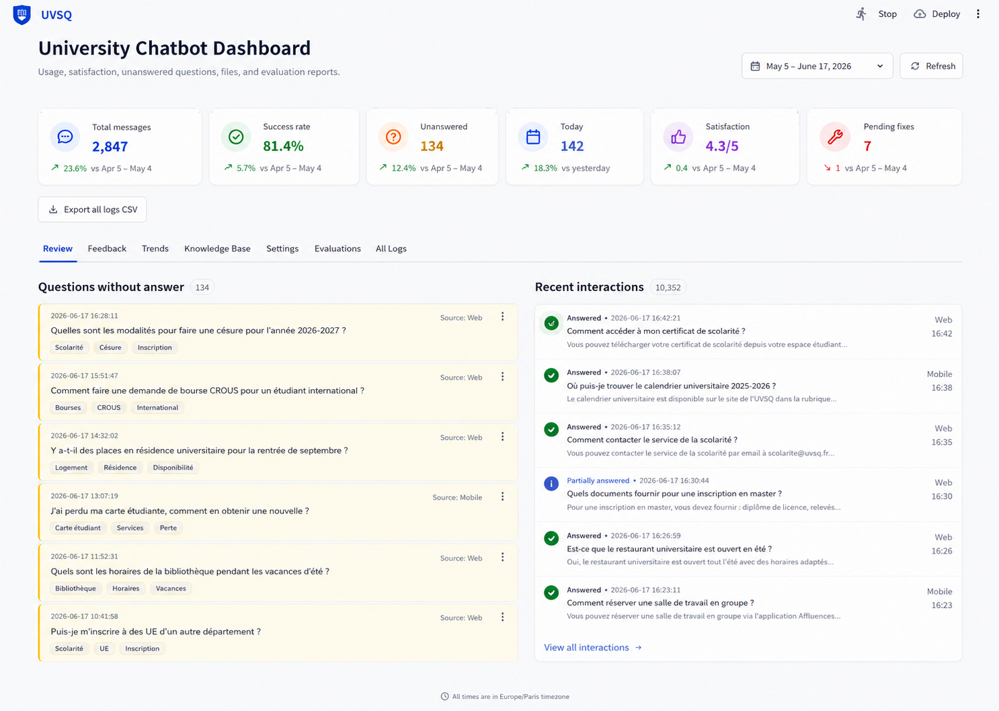
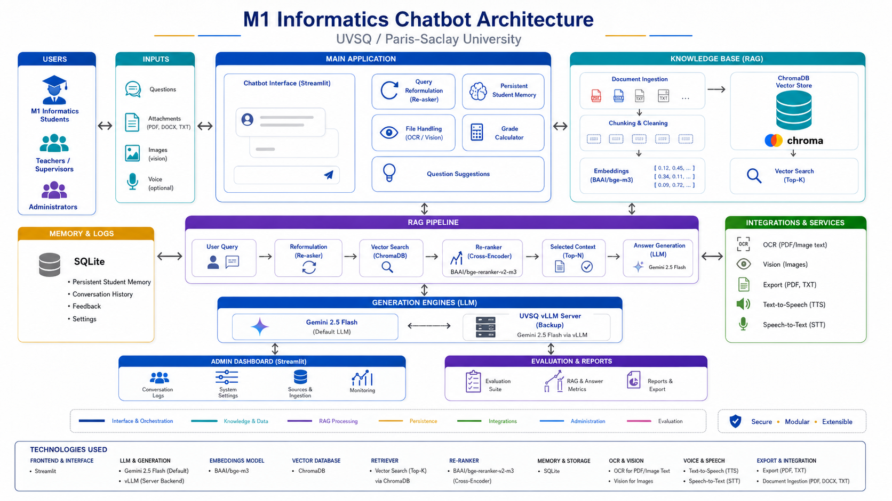
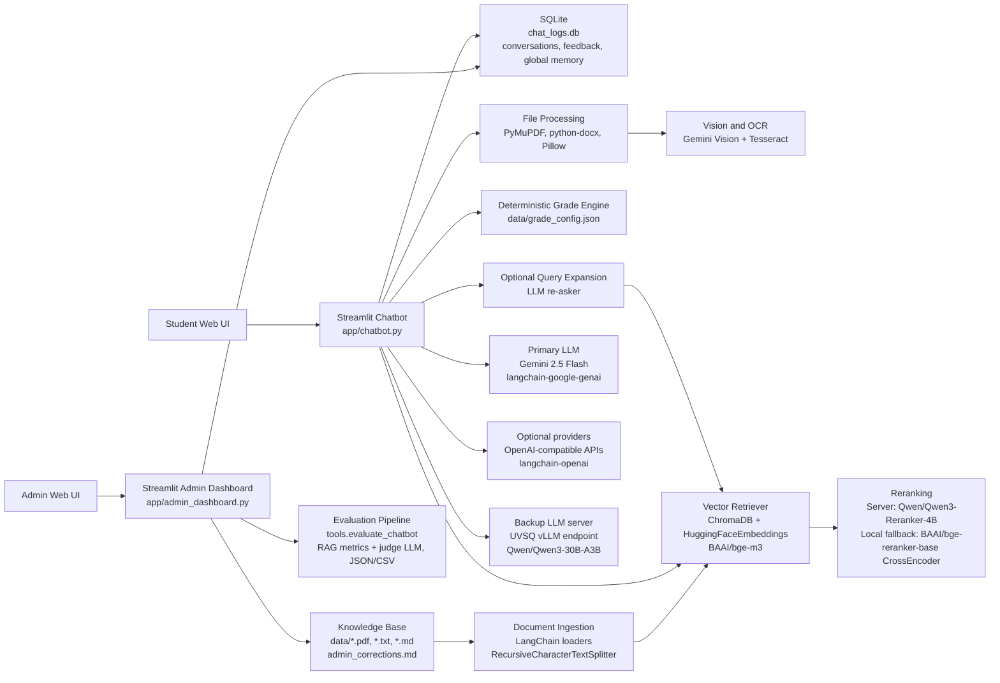

<p align="center">
  
</p>

<h1 align="center">M1 Computer Science Assistant</h1>

<p align="center">
  <strong>Language</strong>:
  <strong>EN</strong> default |
  <a href="README_FR.md">FR</a>
</p>

<p align="center">
  <strong>UVSQ / Universite Paris-Saclay chatbot with RAG, Gemini, vLLM backup, student memory and admin analytics.</strong>
</p>

<table align="center">
  <tr>
    <td align="center" width="96">
      <br>
      <sub><b>Python</b></sub>
    </td>
    <td align="center" width="96">
      <br>
      <sub><b>Streamlit</b></sub>
    </td>
    <td align="center" width="96">
      <br>
      <sub><b>Gemini</b></sub>
    </td>
    <td align="center" width="96">
      <br>
      <sub><b>LangChain</b></sub>
    </td>
    <td align="center" width="96">
      <br>
      <sub><b>Hugging Face</b></sub>
    </td>
    <td align="center" width="96">
      <br>
      <sub><b>SQLite</b></sub>
    </td>
  </tr>
  <tr>
    <td align="center" colspan="3">
      <br>
      <sub><b>ChromaDB</b></sub>
    </td>
    <td align="center" colspan="3">
      <br>
      <sub><b>vLLM</b></sub>
    </td>
  </tr>
</table>

<p align="center">
  
  
  
  
  
</p>

<p align="center">
  <a href="#screenshots">Screenshots</a> |
  <a href="#main-features">Features</a> |
  <a href="#architecture">Architecture</a> |
  <a href="#installation">Installation</a> |
  <a href="README_FR.md">FR version</a>
</p>

This English README is the default project documentation. French version: [README_FR.md](README_FR.md).

This repository contains a Streamlit chatbot and administration dashboard for the Master 1 Computer Science program at UVSQ / Universite Paris-Saclay. The assistant combines a local RAG knowledge base, Gemini-first answer generation, an optional UVSQ/vLLM backup server, persistent student memory, grade calculation, file analysis, exports, evaluation reports, and an admin correction workflow.

By default, the release configuration uses **Gemini** as the primary LLM. The UVSQ/vLLM server remains available as a **backup** when the SSH tunnel is open.

## Table of Contents

- [Screenshots](#screenshots)
- [Main Features](#main-features)
- [Architecture](#architecture)
- [Project Structure](#project-structure)
- [Requirements](#requirements)
- [Installation](#installation)
- [Environment Configuration](#environment-configuration)
- [Run the Project](#run-the-project)
- [Admin Dashboard](#admin-dashboard)
- [Knowledge Base](#knowledge-base)
- [Evaluation](#evaluation)
- [Useful Commands](#useful-commands)
- [Academic Information](#academic-information)
- [Release Notes](#release-notes)

## Screenshots

### Student Chatbot



### Admin Dashboard



## Main Features

### Student Chatbot

- Streamlit web interface styled for UVSQ / Universite Paris-Saclay.
- RAG answers grounded in the M1 program documents stored in ChromaDB.
- Gemini-first LLM routing with optional OpenAI-compatible providers and UVSQ/vLLM backup.
- Optional query expansion/re-asker to improve retrieval before the RAG search.
- Reranking with the UVSQ server reranker first, then local CrossEncoder fallback.
- Persistent student memory shared across conversations.
- Automatic memory extraction for name, age, location, status, parcours, semester, chosen UEs and TER supervisor.
- Memory overwrite support: if the student gives a new name or updated personal fact, the old value is replaced.
- Explicit memory commands: `souviens-toi que ...`, `n'oublie pas que ...`, `remember that ...`, `/remember ...`.
- Conversation history with automatic titles, search, pinning and deletion.
- Guided grade calculator from the sidebar.
- Direct grade calculation from natural chat messages, without opening a separate tool.
- Interactive "Et si..." grade simulator.
- PDF, TXT, MD, DOCX and image upload.
- Image understanding with Gemini Vision when configured, with OCR/Tesseract fallback.
- PDF/DOCX export for generated answers and reports.
- Voice input, text-to-speech, copy, regeneration and like/dislike feedback.
- Recent question suggestions generated from real local chat history.
- Sidebar storage indicator based on local project data.

### Admin Dashboard

- Modern UVSQ-style Streamlit dashboard.
- Real date-range filtering for dashboard statistics, review lists, correction queue, trend charts, CSV exports and complete logs.
- Real comparison against the previous period, for example `+47 vs previous period`.
- Metrics: total messages, success rate, unanswered questions, today's messages, satisfaction and pending fixes.
- Review tab with unanswered questions, source labels and recent interactions.
- Feedback correction queue for disliked answers.
- Correction status workflow: `pending`, `in_review`, `resolved`.
- Ability to append corrected answers into `data/admin_corrections.md`.
- ChromaDB rebuild directly from the dashboard after knowledge updates.
- Knowledge Base tab for document upload, deletion, manual Markdown entries and vector database rebuild.
- Settings tab for runtime feature toggles and model/backend configuration.
- Evaluations tab for JSON reports produced by `tools.evaluate_chatbot`.
- All Logs tab with filters for answered, unanswered, liked and disliked messages.

### RAG and Evaluation

- Document ingestion from `data/`.
- ChromaDB vector store stored locally in `chroma_db/`.
- `BAAI/bge-m3` embeddings through LangChain/Hugging Face.
- Optional smart chunking with Gemini-generated YAML chunking profiles.
- Metadata-aware chunks with source file, page and section information.
- Atomic ChromaDB rebuild with backup.
- Evaluation pipeline aligned with the chatbot retrieval, reranking and generation flow.

## Architecture

<p align="center">
  
</p>

The application is built around two Streamlit interfaces: the student chatbot and the admin dashboard. The chatbot uses a RAG pipeline with ChromaDB, `BAAI/bge-m3` embeddings, server/local reranking, Gemini as the default generation backend, and the UVSQ vLLM server as a backup.



| Layer | Technologies |
| --- | --- |
| UI | Streamlit, custom Streamlit CSS injection |
| RAG retriever | ChromaDB, LangChain, HuggingFaceEmbeddings, `BAAI/bge-m3` |
| Reranking | UVSQ/server reranker `Qwen/Qwen3-Reranker-4B`, local `sentence-transformers` CrossEncoder fallback `BAAI/bge-reranker-base` |
| Generation | Gemini 2.5 Flash by default, optional OpenAI-compatible providers, UVSQ vLLM backup with `Qwen/Qwen3-30B-A3B` |
| Files and vision | PyMuPDF, python-docx, Pillow, Gemini Vision, Tesseract OCR |
| Persistence | SQLite `chat_logs.db`, `.env`, `data/admin_settings.json` |
| Evaluation | `tools.evaluate_chatbot`, RAG scores, judge LLM, JSON/CSV reports |

## Project Structure

```text
.
|-- app/
|   |-- chatbot.py                  # Student chatbot interface
|   |-- admin_dashboard.py          # Admin dashboard
|   `-- assets/
|       `-- m1-assistant-logo.png
|-- chatbot_core/
|   |-- admin_settings.py           # Shared runtime settings
|   |-- chat_logger.py              # SQLite logs, conversations, feedback, memory
|   |-- file_tools.py               # Uploads, OCR and exports
|   |-- grade_calculator.py         # Deterministic grade calculator
|   |-- grade_simulator.py          # "What if" grade simulator
|   |-- ingest_database.py          # ChromaDB ingestion
|   |-- llm_backends.py             # LLM routing order
|   |-- memory_extractor.py         # Memory extraction and replacement
|   |-- query_expander.py           # Optional query expansion
|   |-- reranking.py                # Server/local reranker abstraction
|   |-- session_memory.py           # Useful session history
|   |-- smart_parcing.py            # Optional smart chunking
|   `-- streamlit_theme_inject.py   # Chatbot UI theme
|-- data/
|   |-- grade_config.json           # Grade rules and UE coefficients
|   `-- *.pdf / *.md / *.txt        # RAG source documents
|-- docs/
|   |-- architecture/
|   |   `-- project-architecture.svg
|   `-- screenshots/
|-- evaluation_chatbot/
|   `-- question.md                 # Evaluation questions
|-- tests/
|-- tools/
|   `-- evaluate_chatbot.py         # Evaluation pipeline
|-- .env.example
|-- requirements.txt
|-- setup.md
|-- features.md
|-- README.md
`-- README_FR.md
```

## Requirements

- Python 3.11 or newer.
- Windows PowerShell, or any shell with equivalent commands.
- A Gemini API key for the default setup.
- Optional: SSH access to the UVSQ server for vLLM and server reranking.
- Optional: Tesseract installed locally for OCR fallback.

## Installation

The commands below use Windows PowerShell.

### 1. Clone the Repository

```powershell
cd "$env:USERPROFILE\Desktop"
git clone https://github.com/fennej/chatbot_M1_AMIS_2025_2026.git
cd chatbot_M1_AMIS_2025_2026
```

### 2. Create the Python Environment

```powershell
py -3.11 -m venv .venv
.\.venv\Scripts\Activate.ps1
python -m pip install --upgrade pip
pip install -r requirements.txt
```

If `py -3.11` is not available:

```powershell
python -m venv .venv
.\.venv\Scripts\Activate.ps1
python -m pip install --upgrade pip
pip install -r requirements.txt
```

### 3. Create the Local `.env`

```powershell
copy .env.example .env
notepad .env
```

The project reads `.env`. The `.env.example` file is only a template.

## Environment Configuration

### Recommended Mode: Gemini First

At minimum, configure:

```env
ACTIVE_BACKEND=auto
GEMINI_API_KEY=PASTE_THE_GEMINI_KEY_HERE
GEMINI_MODEL=gemini-2.5-flash
VISION_MODEL=gemini-2.5-flash

EMBEDDING_MODEL=BAAI/bge-m3
RETRIEVAL_TOP_K=12
FINAL_CONTEXT_K=5
RERANKING_ENABLED=true
LOCAL_RERANKER_ENABLED=true
QUERY_EXPANSION_ENABLED=false
```

With this setup, the chatbot uses Gemini first.

### Optional Mode: UVSQ/vLLM Backup

Keep or add:

```env
VLLM_API_BASE=http://localhost:8000/v1
VLLM_BASE_URL=http://localhost:8000/v1
VLLM_API_KEY=unused
VLLM_MODEL=Qwen/Qwen3-30B-A3B
ANSWER_MODEL=Qwen/Qwen3-30B-A3B

RERANKER_API_BASE=http://localhost:8001
RERANKER_MODEL=Qwen/Qwen3-Reranker-4B
RERANKING_ENABLED=true
LOCAL_RERANKER_ENABLED=true
LOCAL_RERANKER_MODEL=BAAI/bge-reranker-base
```

Open the SSH tunnel in a separate terminal when using the UVSQ server:

```powershell
ssh -L 8000:localhost:8000 -L 8001:localhost:8001 YOUR_SERVER_USER@charizard.prism.uvsq.fr
```

Test the tunnel:

```powershell
Invoke-WebRequest http://127.0.0.1:8000/v1/models
Invoke-WebRequest http://127.0.0.1:8001/health
```

### Optional OpenAI-Compatible Providers

```env
OPENAI_COMPAT_BASE_URL=
OPENAI_COMPAT_API_KEY=
OPENAI_COMPAT_MODEL=deepseek-chat
OPENAI_COMPAT_MODELS=

SMART_CHUNKING_ENABLED=false
SMART_CHUNKING_MODEL=gemini-2.5-flash
QUERY_EXPANSION_ENABLED=false
QUERY_EXPANSION_MAX_VARIANTS=3
RERASKER_ENABLED=false
RERASKER_MAX_VARIANTS=3
```

## Run the Project

### 1. Build the RAG Database

From the project root, with `.venv` activated:

```powershell
python -m chatbot_core.ingest_database
```

This reads documents from `data/` and rebuilds `chroma_db/`.

### 2. Start the Chatbot

```powershell
python -m streamlit run app/chatbot.py
```

Local URL:

```text
http://localhost:8501
```

### 3. Start the Admin Dashboard

Open a second PowerShell terminal:

```powershell
.\.venv\Scripts\Activate.ps1
python -m streamlit run app/admin_dashboard.py --server.port 8502
```

Local URL:

```text
http://localhost:8502
```

## Admin Dashboard

The dashboard is designed for project monitoring, testing and maintenance.

1. **Review**: inspect unanswered questions and recent interactions.
2. **Feedback**: correct disliked answers and reinject corrections into the knowledge base.
3. **Trends**: visualize message volume for the selected date range.
4. **Knowledge Base**: add/delete documents and rebuild ChromaDB.
5. **Settings**: update runtime features without editing code.
6. **Evaluations**: read generated evaluation reports.
7. **All Logs**: audit the full filtered chat history.

The date selector at the top filters dashboard metrics, review lists, correction queue, charts, exports and logs. Metric deltas are computed against the previous period with the same duration.

Runtime settings are saved in:

```text
data/admin_settings.json
```

## Knowledge Base

To add a document:

1. Put the file in `data/`, or upload it from the **Knowledge Base** tab.
2. Rebuild the vector database:

```powershell
python -m chatbot_core.ingest_database
```

or click **Rebuild ChromaDB** in the admin dashboard.

Supported source formats:

- PDF
- TXT
- MD

## Evaluation

Evaluation questions are stored in:

```text
evaluation_chatbot/question.md
```

Run a quick evaluation:

```powershell
python -m tools.evaluate_chatbot --max-questions 10
```

Run the full evaluation:

```powershell
python -m tools.evaluate_chatbot
```

Results are generated in `evaluation_chatbot/`:

```text
evaluation_results_YYYYMMDD_HHMMSS.json
evaluation_results_YYYYMMDD_HHMMSS.csv
```

The admin dashboard detects these reports automatically in the **Evaluations** tab.

## Useful Commands

### Check Python Syntax

```powershell
python -m compileall app chatbot_core tests tools
```

### Run Targeted Tests Without Pytest

```powershell
@'
from tests.test_memory_extractor import test_name_memory_can_be_overridden, test_french_name_memory_can_be_overridden
from tests.test_grade_direct_chat import test_direct_grade_query_accepts_short_labels_without_tool_call
from tests.test_query_expander import test_parse_query_variants_strips_numbering_and_dedupes
from tests.test_backend_order import test_generation_order_is_gemini_first_then_server_backup

for test in [
    test_name_memory_can_be_overridden,
    test_french_name_memory_can_be_overridden,
    test_direct_grade_query_accepts_short_labels_without_tool_call,
    test_parse_query_variants_strips_numbering_and_dedupes,
    test_generation_order_is_gemini_first_then_server_backup,
]:
    test()
    print("PASS", test.__name__)
'@ | python -
```

### Test LLM Connectivity

```powershell
python -m tests.test_llm_backends
```

This connectivity script uses local `.env` values and may call external APIs.

## Academic Information

This project was developed as part of a university project at:

- Universite de Versailles Saint-Quentin-en-Yvelines (UVSQ)
- Universite Paris-Saclay

### Supervision

**Yehia TAHER**<br>
Email: yehia.taher@uvsq.fr

**Stephane LOPES**<br>
Email: stephane.lopes@uvsq.fr

### Students

**BESSAA Abderraouf**<br>
Email: abderraouf.bessaa@ens.uvsq.fr

**TIGHILT Idir**<br>
Email: idir.tighilt@ens.uvsq.fr

**DOUADJIA Abdelkarim**<br>
Email: abdelkarim.douadjia@ens.uvsq.fr

## Release Notes

- Gemini is the default generation backend.
- UVSQ/vLLM is kept as backup in `auto` mode.
- Previous retriever and reranker behavior is preserved through ChromaDB retrieval and local CrossEncoder fallback.
- Admin dashboard includes real date-filtered statistics and previous-period comparisons.
- Global student memory supports automatic updates and personal fact replacement.
- Direct chat grade calculation works without opening a separate tool.
- Screenshots and architecture assets are included in `docs/`.
