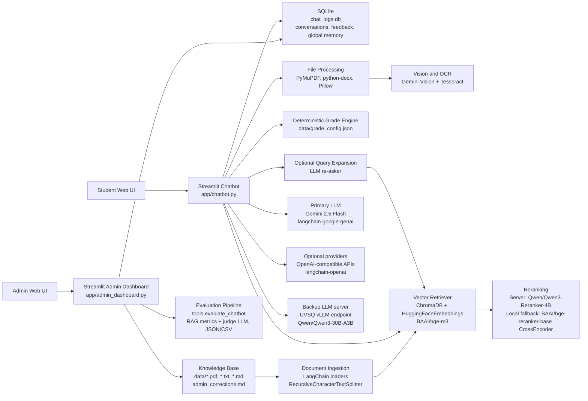

<h1 align="center">Assistant M1 Computer Science</h1>

<p align="center">
  <strong>Langue</strong> :
  <a href="README.md">EN</a> par defaut |
  <strong>FR</strong>
</p>

<p align="center">
  <strong>Chatbot UVSQ / Universite Paris-Saclay avec RAG, Gemini, backup vLLM, memoire etudiante et dashboard admin.</strong>
</p>

<p align="center">
  
  &nbsp;&nbsp;
  
  &nbsp;&nbsp;
  
  &nbsp;&nbsp;
  
  &nbsp;&nbsp;
  
  &nbsp;&nbsp;
  
</p>

<p align="center">
  
  &nbsp;&nbsp;&nbsp;
  
</p>

<p align="center">
  
  
  
  
  
</p>

<p align="center">
  <a href="#captures">Captures</a> |
  <a href="#fonctionnalites-principales">Fonctionnalites</a> |
  <a href="#architecture">Architecture</a> |
  <a href="#installation">Installation</a> |
  <a href="README.md">Version EN</a>
</p>

Documentation francaise. La version anglaise [README.md](README.md) reste la documentation par defaut du projet.

Ce depot contient un chatbot Streamlit et un dashboard administrateur pour le Master 1 Computer Science UVSQ / Universite Paris-Saclay. L'assistant combine une base documentaire RAG locale, Gemini comme backend principal, un serveur UVSQ/vLLM optionnel en secours, une memoire etudiante persistante, le calcul de moyenne, l'analyse de fichiers, les exports, les rapports d'evaluation et un workflow de correction admin.

Par defaut, la configuration de release utilise **Gemini** comme LLM principal. Le serveur UVSQ/vLLM reste disponible comme **solution de secours** lorsque le tunnel SSH est ouvert.

## Table Des Matieres

- [Captures](#captures)
- [Fonctionnalites Principales](#fonctionnalites-principales)
- [Architecture](#architecture)
- [Structure Du Projet](#structure-du-projet)
- [Prérequis](#prérequis)
- [Installation](#installation)
- [Configuration De Lenvironnement](#configuration-de-lenvironnement)
- [Lancer Le Projet](#lancer-le-projet)
- [Dashboard Admin](#dashboard-admin)
- [Base De Connaissance](#base-de-connaissance)
- [Evaluation](#evaluation)
- [Commandes Utiles](#commandes-utiles)
- [Informations Academiques](#informations-academiques)
- [Notes De Release](#notes-de-release)

## Captures

### Interface Chatbot


### Dashboard Administrateur


## Fonctionnalites Principales

### Chatbot Etudiant

- Interface web Streamlit adaptee au style UVSQ / Universite Paris-Saclay.
- Reponses RAG fondees sur les documents du M1 stockes dans ChromaDB.
- Routage LLM avec Gemini en premier, fournisseurs OpenAI-compatibles optionnels, puis serveur UVSQ/vLLM en secours.
- Re-asker / expansion de requete optionnelle pour ameliorer la recherche documentaire.
- Reranking avec le serveur UVSQ en premier, puis fallback local CrossEncoder.
- Memoire etudiante persistante partagee entre toutes les conversations.
- Extraction automatique de la memoire : nom, age, lieu, statut, parcours, semestre, UEs choisies et encadrant TER.
- Remplacement des informations personnelles : si l'etudiant donne un nouveau nom ou une nouvelle information stable, l'ancienne valeur est remplacee.
- Commandes de memoire explicites : `souviens-toi que ...`, `n'oublie pas que ...`, `remember that ...`, `/remember ...`.
- Historique des conversations avec titres automatiques, recherche, epinglage et suppression.
- Calculateur de moyenne guide depuis la barre laterale.
- Calcul de moyenne direct depuis un message naturel, sans ouvrir d'outil separe.
- Simulateur interactif "Et si..." pour tester differents scenarios de notes.
- Upload PDF, TXT, MD, DOCX et images.
- Analyse d'images avec Gemini Vision quand la cle est configuree, avec fallback OCR/Tesseract.
- Export PDF/DOCX pour les reponses et rapports generes.
- Saisie vocale, lecture vocale, copie, regeneration et feedback like/dislike.
- Suggestions recentes generees depuis le vrai historique local.
- Indicateur d'espace utilise dans la barre laterale.

### Dashboard Admin

- Dashboard Streamlit modernise avec un style UVSQ.
- Filtrage reel par periode pour les statistiques, listes de review, file de correction, graphiques, exports CSV et logs complets.
- Comparaison reelle avec la periode precedente, par exemple `+47 vs previous period`.
- Metriques : total messages, taux de succes, questions sans reponse, messages du jour, satisfaction et corrections en attente.
- Onglet Review avec questions sans reponse, sources et interactions recentes.
- File de correction pour les reponses dislikees.
- Workflow de correction : `pending`, `in_review`, `resolved`.
- Ajout d'une reponse corrigee dans `data/admin_corrections.md`.
- Reconstruction de ChromaDB depuis le dashboard apres mise a jour de la connaissance.
- Onglet Knowledge Base pour upload, suppression, entree Markdown manuelle et rebuild de la base vectorielle.
- Onglet Settings pour modifier les options runtime et la configuration des modeles.
- Onglet Evaluations pour lire les rapports JSON produits par `tools.evaluate_chatbot`.
- Onglet All Logs avec filtres answered, unanswered, liked et disliked.

### RAG Et Evaluation

- Ingestion des documents depuis `data/`.
- Base vectorielle ChromaDB stockee localement dans `chroma_db/`.
- Embeddings `BAAI/bge-m3` via LangChain/Hugging Face.
- Smart chunking optionnel avec profils YAML generes par Gemini.
- Chunks enrichis avec metadonnees : fichier source, page et section.
- Reconstruction atomique de ChromaDB avec backup.
- Pipeline d'evaluation aligne avec le flux reel du chatbot : retrieval, reranking et generation.

## Architecture

<p align="center">
  
</p>

L'application est structuree autour de deux interfaces Streamlit : le chatbot etudiant et le dashboard admin. Le chatbot utilise un pipeline RAG avec ChromaDB, embeddings `BAAI/bge-m3`, reranking serveur/local, Gemini comme backend de generation par defaut et le serveur UVSQ/vLLM comme secours.



| Couche | Technologies |
| --- | --- |
| UI | Streamlit, injection CSS Streamlit personnalisee |
| Retriever RAG | ChromaDB, LangChain, HuggingFaceEmbeddings, `BAAI/bge-m3` |
| Reranking | Reranker serveur UVSQ `Qwen/Qwen3-Reranker-4B`, fallback local `sentence-transformers` CrossEncoder `BAAI/bge-reranker-base` |
| Generation | Gemini 2.5 Flash par defaut, fournisseurs OpenAI-compatibles optionnels, secours UVSQ/vLLM avec `Qwen/Qwen3-30B-A3B` |
| Fichiers et vision | PyMuPDF, python-docx, Pillow, Gemini Vision, Tesseract OCR |
| Persistance | SQLite `chat_logs.db`, `.env`, `data/admin_settings.json` |
| Evaluation | `tools.evaluate_chatbot`, scores RAG, juge LLM, rapports JSON/CSV |

## Structure Du Projet

```text
.
|-- app/
|   |-- chatbot.py                  # Interface principale du chatbot
|   |-- admin_dashboard.py          # Dashboard administrateur
|   `-- assets/
|       `-- m1-assistant-logo.png
|-- chatbot_core/
|   |-- admin_settings.py           # Reglages runtime partages
|   |-- chat_logger.py              # SQLite logs, conversations, feedback, memoire
|   |-- file_tools.py               # Uploads, OCR et exports
|   |-- grade_calculator.py         # Calculateur deterministe de moyenne
|   |-- grade_simulator.py          # Simulateur "Et si..."
|   |-- ingest_database.py          # Ingestion ChromaDB
|   |-- llm_backends.py             # Ordre de routage LLM
|   |-- memory_extractor.py         # Extraction et remplacement memoire
|   |-- query_expander.py           # Expansion de requete optionnelle
|   |-- reranking.py                # Abstraction reranker serveur/local
|   |-- session_memory.py           # Historique utile de session
|   |-- smart_parcing.py            # Smart chunking optionnel
|   `-- streamlit_theme_inject.py   # Theme UI du chatbot
|-- data/
|   |-- grade_config.json           # Regles de notes et coefficients
|   `-- *.pdf / *.md / *.txt        # Documents sources RAG
|-- docs/
|   |-- architecture/
|   |   `-- project-architecture.svg
|   `-- screenshots/
|-- evaluation_chatbot/
|   `-- question.md                 # Questions d'evaluation
|-- tests/
|-- tools/
|   `-- evaluate_chatbot.py         # Pipeline d'evaluation
|-- .env.example
|-- requirements.txt
|-- setup.md
|-- features.md
|-- README.md
`-- README_FR.md
```

## Prérequis

- Python 3.11 ou plus recent.
- Windows PowerShell, ou un terminal equivalent.
- Une cle API Gemini pour la configuration par defaut.
- Optionnel : acces SSH au serveur UVSQ pour vLLM et le reranker serveur.
- Optionnel : Tesseract installe localement pour le fallback OCR.

## Installation

Les commandes ci-dessous utilisent Windows PowerShell.

### 1. Cloner Le Depot

```powershell
cd "$env:USERPROFILE\Desktop"
git clone https://github.com/fennej/chatbot_M1_AMIS_2025_2026.git
cd chatbot_M1_AMIS_2025_2026
```

### 2. Creer L'Environnement Python

```powershell
py -3.11 -m venv .venv
.\.venv\Scripts\Activate.ps1
python -m pip install --upgrade pip
pip install -r requirements.txt
```

Si `py -3.11` n'existe pas :

```powershell
python -m venv .venv
.\.venv\Scripts\Activate.ps1
python -m pip install --upgrade pip
pip install -r requirements.txt
```

### 3. Creer Le Fichier `.env`

```powershell
copy .env.example .env
notepad .env
```

Le projet lit `.env`. Le fichier `.env.example` sert seulement de modele.

## Configuration De Lenvironnement

### Mode Recommande : Gemini En Premier

Configurer au minimum :

```env
ACTIVE_BACKEND=auto
GEMINI_API_KEY=COLLER_LA_CLE_GEMINI_ICI
GEMINI_MODEL=gemini-2.5-flash
VISION_MODEL=gemini-2.5-flash

EMBEDDING_MODEL=BAAI/bge-m3
RETRIEVAL_TOP_K=12
FINAL_CONTEXT_K=5
RERANKING_ENABLED=true
LOCAL_RERANKER_ENABLED=true
QUERY_EXPANSION_ENABLED=false
```

Avec cette configuration, le chatbot utilise Gemini en premier.

### Option : Serveur UVSQ/vLLM En Secours

Garder ou ajouter :

```env
VLLM_API_BASE=http://localhost:8000/v1
VLLM_BASE_URL=http://localhost:8000/v1
VLLM_API_KEY=unused
VLLM_MODEL=Qwen/Qwen3-30B-A3B
ANSWER_MODEL=Qwen/Qwen3-30B-A3B

RERANKER_API_BASE=http://localhost:8001
RERANKER_MODEL=Qwen/Qwen3-Reranker-4B
RERANKING_ENABLED=true
LOCAL_RERANKER_ENABLED=true
LOCAL_RERANKER_MODEL=BAAI/bge-reranker-base
```

Ouvrir le tunnel SSH dans un terminal separe :

```powershell
ssh -L 8000:localhost:8000 -L 8001:localhost:8001 YOUR_SERVER_USER@charizard.prism.uvsq.fr
```

Tester le tunnel :

```powershell
Invoke-WebRequest http://127.0.0.1:8000/v1/models
Invoke-WebRequest http://127.0.0.1:8001/health
```

### Fournisseurs OpenAI-Compatibles Optionnels

```env
OPENAI_COMPAT_BASE_URL=
OPENAI_COMPAT_API_KEY=
OPENAI_COMPAT_MODEL=deepseek-chat
OPENAI_COMPAT_MODELS=

SMART_CHUNKING_ENABLED=false
SMART_CHUNKING_MODEL=gemini-2.5-flash
QUERY_EXPANSION_ENABLED=false
QUERY_EXPANSION_MAX_VARIANTS=3
RERASKER_ENABLED=false
RERASKER_MAX_VARIANTS=3
```

## Lancer Le Projet

### 1. Construire La Base RAG

Depuis la racine du projet, avec `.venv` active :

```powershell
python -m chatbot_core.ingest_database
```

Cette commande lit les documents dans `data/` et reconstruit `chroma_db/`.

### 2. Lancer Le Chatbot

```powershell
python -m streamlit run app/chatbot.py
```

URL locale :

```text
http://localhost:8501
```

### 3. Lancer Le Dashboard Admin

Ouvrir un deuxieme terminal PowerShell :

```powershell
.\.venv\Scripts\Activate.ps1
python -m streamlit run app/admin_dashboard.py --server.port 8502
```

URL locale :

```text
http://localhost:8502
```

## Dashboard Admin

Le dashboard sert au monitoring, aux tests et a la maintenance du projet.

1. **Review** : inspecter les questions sans reponse et les interactions recentes.
2. **Feedback** : corriger les reponses dislikees et reinjecter les corrections dans la base.
3. **Trends** : visualiser le volume de messages sur la periode selectionnee.
4. **Knowledge Base** : ajouter/supprimer des documents et reconstruire ChromaDB.
5. **Settings** : modifier les options runtime sans modifier le code.
6. **Evaluations** : lire les rapports d'evaluation generes.
7. **All Logs** : auditer l'historique filtre complet.

Le selecteur de date en haut filtre les metriques, les listes de review, la file de correction, les graphes, les exports et les logs. Les deltas des metriques sont calcules par rapport a la periode precedente de meme duree.

Les reglages runtime sont sauvegardes dans :

```text
data/admin_settings.json
```

## Base De Connaissance

Pour ajouter un document :

1. Placer le fichier dans `data/`, ou l'uploader depuis l'onglet **Knowledge Base**.
2. Reconstruire la base vectorielle :

```powershell
python -m chatbot_core.ingest_database
```

ou cliquer sur **Rebuild ChromaDB** dans le dashboard admin.

Formats supportes :

- PDF
- TXT
- MD

## Evaluation

Les questions d'evaluation sont dans :

```text
evaluation_chatbot/question.md
```

Lancer une evaluation rapide :

```powershell
python -m tools.evaluate_chatbot --max-questions 10
```

Lancer l'evaluation complete :

```powershell
python -m tools.evaluate_chatbot
```

Les resultats sont generes dans `evaluation_chatbot/` :

```text
evaluation_results_YYYYMMDD_HHMMSS.json
evaluation_results_YYYYMMDD_HHMMSS.csv
```

Le dashboard admin detecte automatiquement ces rapports dans l'onglet **Evaluations**.

## Commandes Utiles

### Verifier La Syntaxe Python

```powershell
python -m compileall app chatbot_core tests tools
```

### Lancer Les Tests Cibles Sans Pytest

```powershell
@'
from tests.test_memory_extractor import test_name_memory_can_be_overridden, test_french_name_memory_can_be_overridden
from tests.test_grade_direct_chat import test_direct_grade_query_accepts_short_labels_without_tool_call
from tests.test_query_expander import test_parse_query_variants_strips_numbering_and_dedupes
from tests.test_backend_order import test_generation_order_is_gemini_first_then_server_backup

for test in [
    test_name_memory_can_be_overridden,
    test_french_name_memory_can_be_overridden,
    test_direct_grade_query_accepts_short_labels_without_tool_call,
    test_parse_query_variants_strips_numbering_and_dedupes,
    test_generation_order_is_gemini_first_then_server_backup,
]:
    test()
    print("PASS", test.__name__)
'@ | python -
```

### Tester La Connectivite LLM

```powershell
python -m tests.test_llm_backends
```

Ce script utilise les valeurs locales de `.env` et peut appeler des APIs externes.

## Informations Academiques

Ce projet a ete developpe dans le cadre d'un projet universitaire a :

- Universite de Versailles Saint-Quentin-en-Yvelines (UVSQ)
- Universite Paris-Saclay

### Encadrement

**Yehia TAHER**<br>
Email : yehia.taher@uvsq.fr

**Stephane LOPES**<br>
Email : stephane.lopes@uvsq.fr

### Etudiants

**BESSAA Abderraouf**<br>
Email : abderraouf.bessaa@ens.uvsq.fr

**TIGHILT Idir**<br>
Email : idir.tighilt@ens.uvsq.fr

**DOUADJIA Abdelkarim**<br>
Email : abdelkarim.douadjia@ens.uvsq.fr

## Notes De Release

- Gemini est le backend de generation par defaut.
- UVSQ/vLLM reste disponible comme backup en mode `auto`.
- Le comportement precedent du retriever et du reranker est conserve avec ChromaDB et le fallback local CrossEncoder.
- Le dashboard admin inclut des statistiques filtrees par date et des comparaisons avec la periode precedente.
- La memoire etudiante globale gere la mise a jour automatique et le remplacement des informations personnelles.
- Le calcul de moyenne direct fonctionne dans le chat sans ouvrir d'outil separe.
- Les captures et assets d'architecture sont inclus dans `docs/`.
